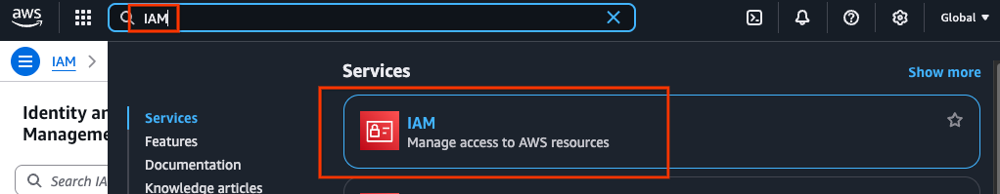
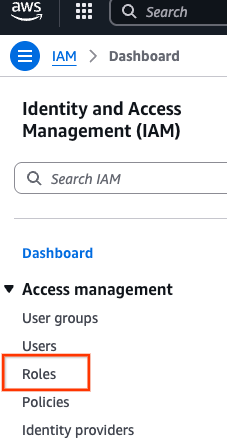
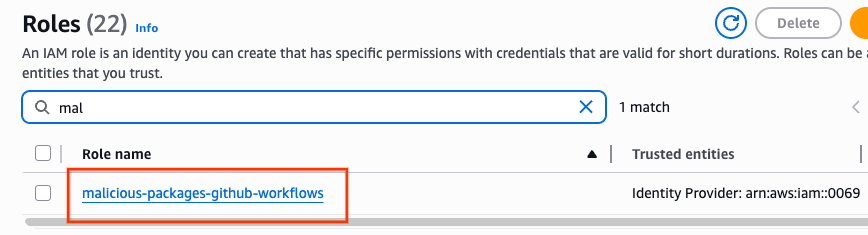
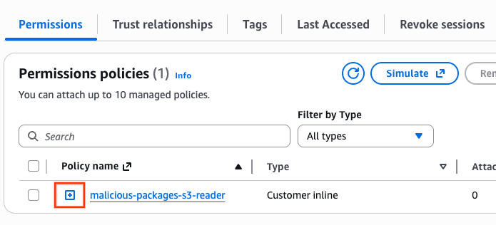
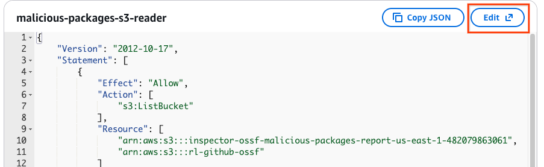
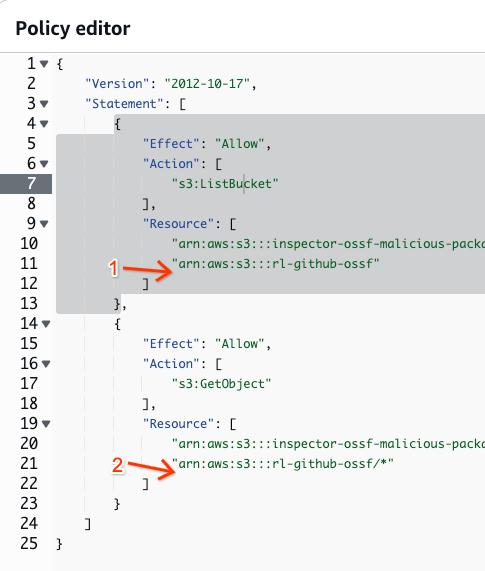
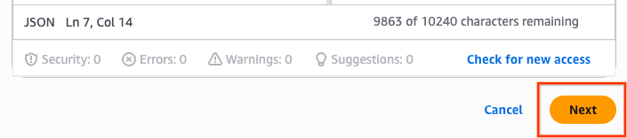
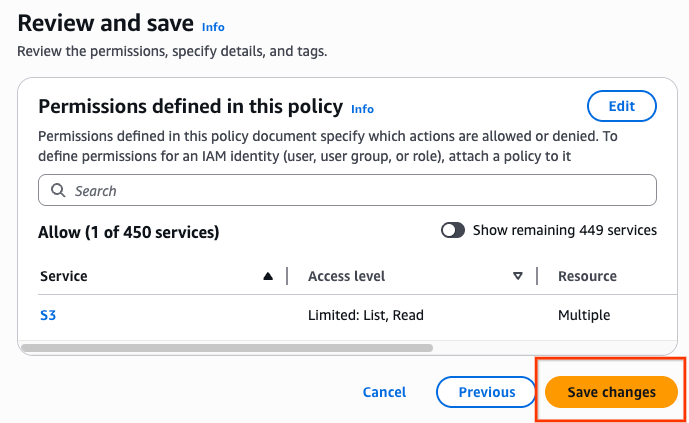

# Purpose

Document the process of authorizing the Malicious Package AWS IAM role to access an external AWS S3 bucket.

# Details

The OpenSSF AWS account has an IAM Role specifically used by the
Malicious Packages project for authorizing access to AWS S3 buckets.

The IAM Role is identified using the following ARNs:

- Role ARN: `arn:aws:iam::006974884227:role/malicious-packages-github-workflows`
- Assumed Role ARN: `arn:aws:sts::006974884227:assumed-role/malicious-packages-github-workflows/GitHubActions`

Authentication to AWS is achieved using OIDC to avoid storing long-lived
credentials. Only workflows on the `main` branch, and the
`aws-integration` branch will authenticate.

`ListBucket` and `GetObject` permissions must be added to both the
third party AWS account and the OpenSSF AWS account.

# Process

## Third Party Authorization

The external third party, whose AWS S3 bucket needs to be accessed to ingest reports, must grant the `ListBucket` permission on the bucket and `GetObject` on the contents of the S3 bucket using the "Role ARN" above.

## OpenSSF IAM Role Authorization

This process assumes access to the OpenSSF AWS account.

### 1. Open the Malicious Packages IAM role

Go to the IAM service. This is most easily done using the search box.

Use the sidebar to go to the Roles part of the IAM service.

Find the role named "malicious-packages-github-workflows" and click
the link to open its details.

### 2. Edit the reader policy

The default tab is the "permissions" tab. The
"malicious-packages-github-workflows" role has a single policy called
"malicious-packages-s3-reader".

Click the "plus" icon next to the role to expand its configuration.

Next, click the "edit" button to modify the policy.

### 3. Changing the reader policy

The `s3:ListBucket` and `s3:GetObject` permissions both need to have
the third party S3 bucket added to each resource list.

For the given `{bucket-name}` the following resources need to be added:

- `s3:ListBucket`: add `"arn:aws:s3:::{bucket-name}"`
- `s3:GetObject`: add `"arn:aws:s3:::{bucket-name}/*"` (note the suffix)

### 4. Check and Save

After editing click the "next" button.

Review the changes on the next page, and if everything is correct,
click the "save changes" button.

## Test the Changes

Push changes to branch `aws-integration` to configure use of the
third party bucket.

Manually invoke the "Ingest Cloud OSV" for the `aws-integration`
branch.

**Note:** the final `git push` step of the "Ingest Cloud OSV" is
skipped for all branches, except "main".